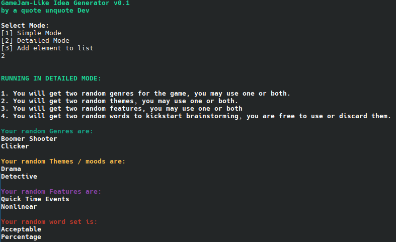

# GAMEJAM-LIKE IDEA GENERATOR
### V0.1 BY A QUOTE UNQUOTE DEV.
My code is published under the MIT License.

This is a small little project I made one night to teach myself the very basics of python.
It gives you random ideas for speed game development and prototyping as if you were participating
in a game jam.




### How to use:
#### Linux:

You can download from the releases page and:
1. Extract the zip file contents
2. Run the executable file from the terminal
```
    ./generator
```
Alternatively, you can run it from the source code:
1. Install python on your distro.
2. Clone this repository.
3. Open a terminal window in the repository folder
4. Create a virtual environment for python. For example:
```
    python -m venv environment
```
5. Activate your environment:
```
    source environment/bin/activate
```
6. Install colorama with pip:
```
    pip install colorama
```  
7. Execute the script
```
    environment/bin/python generator.py
```


Apologies for not having Windows instructions or an executable at the moment.
It's on my to-do list to get some ready when I get access to a Windows machine.

### Attributions:
- Uses Colorama by Jonathan Hartley published under the BSD 3-Clause "New" or "Revised" License: https://github.com/tartley/colorama/tree/master
- Noun and adjective lists made by crazy hugsy and published under the MIT license: https://github.com/hugsy/stuff
- Lists of genres and features from the steamworks documentation: https://partner.steamgames.com/doc/store/tags

